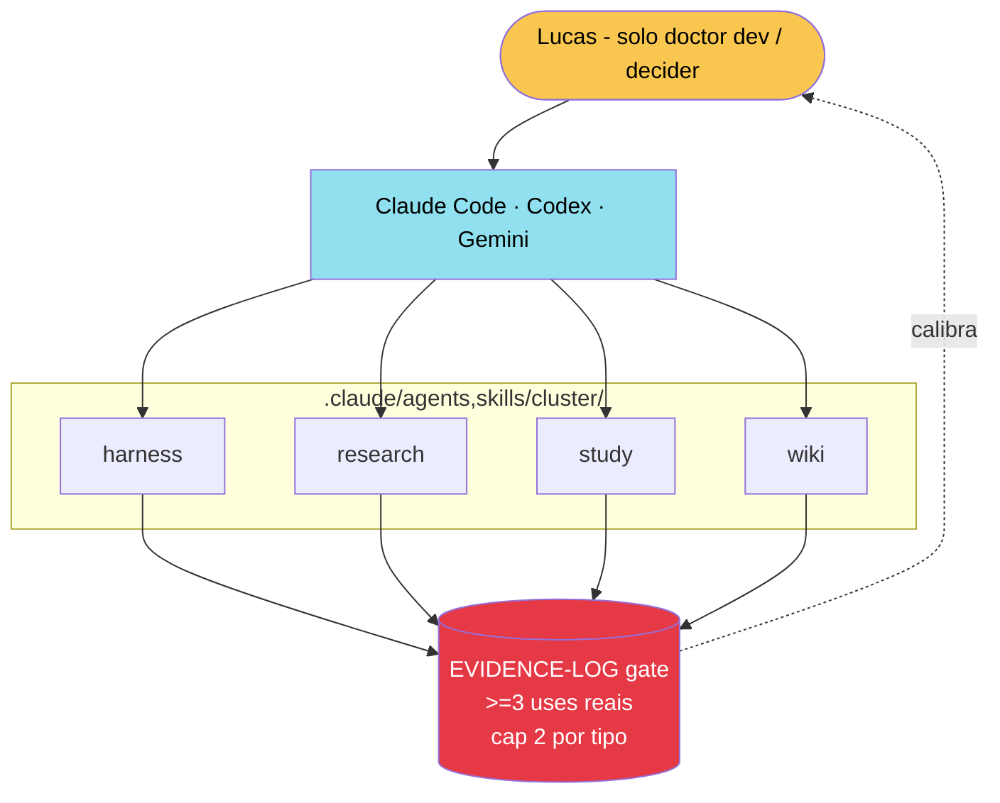

# Cluster Architecture

Prometeus aceita agents/subagents/skills em `.claude/{agents,skills}/<cluster>/`, em 4 clusters fixos com cap baixo e gate de evidencia.

Reverte regra anterior `KBP-04` "mantem zero". Justificativa: tendencia industria 2026 das 3 plataformas (Claude Code, Codex, Gemini), nao precedente OLMO. Veja [[Agent Usage Map]] e [[Agent Module Encapsulation]] para o contrato operacional detalhado.

## Topologia

## 4 clusters fixos

- **harness**: validacao, integrity, boundary. Process-bound.
- **research**: SOTA gate, EBM, PubMed/Scholar. Input-bound.
- **study**: trilhas, concurso, anki. Artifact-bound.
- **wiki**: Obsidian, crossref, graph. Knowledge-bound.

Adicao de cluster novo exige trigger registrado em [[SOTA Research Gate]] + retire de cluster orfao por 60 dias + aprovacao humana.

## Cap e gate

- Cap por cluster por tipo: 2 itens (agents max 2, skills max 2). Total max teorico = 16.
- Gate de adicao: procedure precisa de >=3 entries em [[Evidence Log]] em 30 dias para virar skill. Subagent so depois de skill `operational` por 30 dias.
- Sem cluster cross: 1 item = 1 cluster.
- Anti-sprawl: cap atingido = retire dormante (>60d) antes de adicionar.

Veja [[Promotion Gate]] para o contrato de transicao entre lanes.

## Phase 0 (hoje)

Pastas vazias com `.gitkeep` em `.claude/{agents,skills}/{harness,research,study,wiki}/`. Zero `.md` versionado. Skills/agents entram um por vez quando o gate justificar. Veja [[Foundation Harness]] para a validacao automatica via `scripts/integrity.sh > check_cluster_contract`.

## Path to principal

Prometeus pode virar projeto principal por acumulo (nao substituicao) quando 8 criterios absolutos estiverem `true` por >=30 dias: maturidade executavel, boundary 100%, anti-teatro, evidencia operacional (>=3 procedures `operational`), PHI/seguranca, reversibilidade, self-evolution, decisao humana reafirmada. Hoje 0/8. Estimativa 12-18 meses. Detalhe em `shadow/CLUSTER-CONTRACT.md > Path to principal`.

Humildade simetrica: Prometeus pode ser superseded um dia pelos mesmos criterios. A doutrina persiste; o artefato e descartavel. Ver [[SOTA Dev Solo]] para o contexto solo medico que sustenta a regra.

## Diferenca vs OLMO

OLMO foi vibe-coded com retrabalho (21 agents, 19 skills, 35 hooks sem gate documentado). E precedente, nao autoridade. Prometeus aceita a topologia (Lucas no topo, orquestrador, clusters) como inspiracao industria, mas adapta lean: cap baixo, gate >=3 evidencias, frontmatter completo. Cherrypicks exigem evidencia independente + adaptacao, nao porte literal.

## Links

- [[Agent Usage Map]]
- [[Agent Module Encapsulation]]
- [[Foundation Harness]]
- [[Promotion Gate]]
- [[Evidence Log]]
- [[SOTA Research Gate]]
- [[SOTA Dev Solo]]
- [[Vault Anti-Pollution]]
