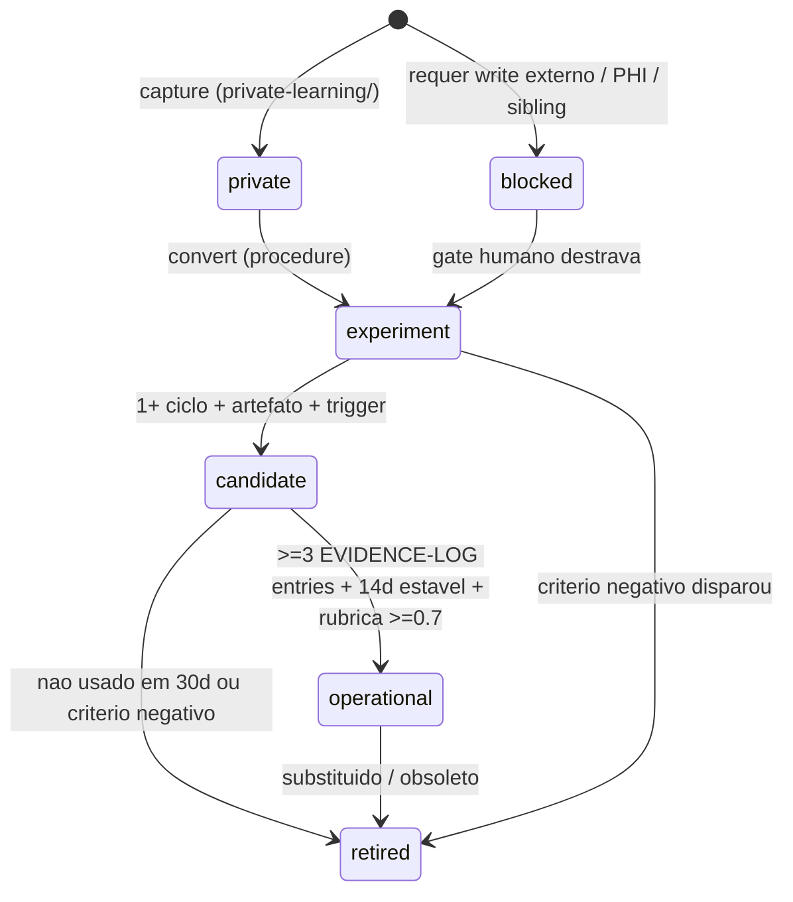
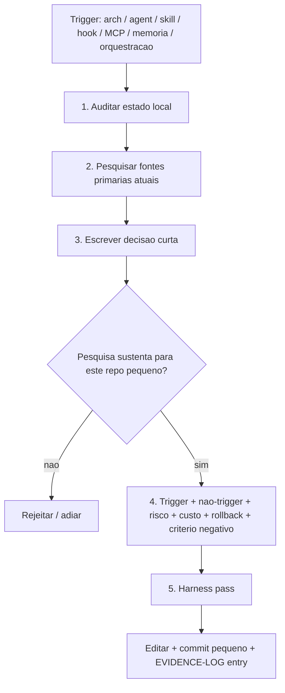
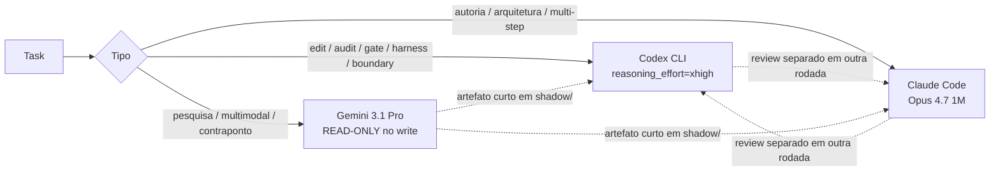

# open OLMO_PROMETEUS

Laboratorio paralelo solo, baixo risco, para validar fluxo (digest, study, wiki, gates de promocao), maturidade executavel e self-evolution read-only antes de promover qualquer artefato para `OLMO` (repo principal, intocavel sem autorizacao explicita).

`OLMO` e o primeiro projeto decente e aqui vira piso, nao teto: Prometeus precisa ser maior em boundary, evidencia, privacidade, rollback e anti-teatro, sem copiar runtime ou cerimonia.

Be terse: politica vive uma vez em [`AGENTS.md`](AGENTS.md); adaptadores nao duplicam.

## Stack

Workspace canonico unico: `/home/lucasmiachon/projects/OLMO_PROMETEUS` em Linux/WSL ext4 (Ubuntu 24.04 LTS).

| Camada | Tool | Versao | Wired-in |
|---|---|---|---|
| Core shell | `bash` 5.2.21 | system | scripts, hooks, harness |
| VCS | `git` 2.43, `gh` 2.45 | system | `.github/workflows/`, `shadow/GITHUB-REMOTE-WSL.md` |
| Search | `rg` 14.1.1 | user-space | usado em `scripts/check.sh` |
| JSON | `jq` 1.7 | system | usado em `scripts/check.sh` para validar `internal/evolution/*.json` |
| Agent CLI | `claude` 2.1.119 | global | autoria/arquitetura (Opus 4.7 1M) |
| Agent CLI | `codex` 0.125.0 | global | edicao/auditoria (`reasoning_effort=xhigh`) |
| Agent CLI | `gemini` 0.39.1 | global | pesquisa/contraponto (READ-ONLY) |
| Python | `uv` 0.11.7 + `ruff` 0.15.12 | user-space | [`lab/wiki-graph-lab/pyproject.toml`](lab/wiki-graph-lab/pyproject.toml) + `uv.lock` |
| JS/JSON | `biome` 2.4.13 | global | [`biome.json`](biome.json) raiz (lint+format JSON `internal/`, JS `lab/`) |
| JS pkg mgr | `pnpm` 10.33.2 + `node` 20.20.2 | global | entra quando houver projeto JS-heavy real |
| JS runtime | `bun` 1.3.13 | user-space | experimento por projeto |
| UX | `zellij` 0.44.1 | user-space | multi-pane terminal opcional |

Diagnostico rapido: `./scripts/install-stack.sh` (idempotente, sem sudo, reporta presence + versao + path).

## Quick start

```bash
git clone <repo> /home/lucasmiachon/projects/OLMO_PROMETEUS
cd /home/lucasmiachon/projects/OLMO_PROMETEUS
./scripts/install-stack.sh         # diagnostico do stack
./scripts/check.sh --strict        # harness completo (0 warns/fails)
```

## Workflow

### Lanes lifecycle

Estados de artefato. Fonte unica: [`shadow/WORK-LANES.md`](shadow/WORK-LANES.md). Transicoes aplicadas: [`shadow/INCORPORATION-LOG.md`](shadow/INCORPORATION-LOG.md). Evidencia: [`shadow/EVIDENCE-LOG.md`](shadow/EVIDENCE-LOG.md).



### SOTA Research Gate

Mudancas de arquitetura, agente, skill, hook, MCP, memoria ou orquestracao passam por este gate. Rubrica em [`AGENTS.md > SOTA Research Gate`](AGENTS.md). Decisoes registradas: [`shadow/SOTA-DECISIONS.md`](shadow/SOTA-DECISIONS.md) e [`docs/adr/`](docs/adr/).



### Executor selection

Codex e Claude Code sao executores autorizados, mas **nunca juntos no mesmo escopo de tarefa**. Gemini e pesquisa/contraponto sem write. Ver ADR `0006-triadic-stack-debate` e SOTA-DECISIONS `Exclusive executor rule`.



## Boundaries duras

1. Nunca escrever fora de `/home/lucasmiachon/projects/OLMO_PROMETEUS`. Read externo de sibling/legado exige autorizacao humana citando caminho e motivo.
2. Sibling principal (`OLMO`) e read-only autorizado caso-a-caso. Nunca write; copiar com melhoras para canonical.
3. Push em `origin/main` exige confirmacao humana explicita por rodada.
4. Sem `--no-verify`, `--no-gpg-sign` ou skip de hook. Investigar root cause.

Detalhes + lista completa: [`AGENTS.md > Fundamental Boundary`](AGENTS.md) e [`shadow/HANDOFF.md > Boundaries duras`](shadow/HANDOFF.md).

## Entrada por funcao

| Voce quer... | Va para |
|---|---|
| hidratar nova sessao apos `/clear` | [`shadow/HANDOFF.md`](shadow/HANDOFF.md) |
| entender o contrato | [`AGENTS.md`](AGENTS.md) |
| entender valores/objetivos/gaps | [`VALUES.md`](VALUES.md) |
| entender lanes/promocao | [`shadow/WORK-LANES.md`](shadow/WORK-LANES.md) |
| ver decisoes SOTA + ADRs | [`shadow/SOTA-DECISIONS.md`](shadow/SOTA-DECISIONS.md), [`docs/adr/`](docs/adr/) |
| ver producer-consumer/antifragile gate | [`shadow/ORCHESTRATION-HARNESS-ANTIFRAGILE.md`](shadow/ORCHESTRATION-HARNESS-ANTIFRAGILE.md) |
| ver backlog self-evolving | [`shadow/BACKLOG.md`](shadow/BACKLOG.md), [`internal/evolution/backlog.json`](internal/evolution/backlog.json) |
| navegar wiki conceitual | `Prometeus/wiki/Home.md` (Obsidian) |
| rodar harness | `./scripts/check.sh --strict` |
| diagnosticar stack | `./scripts/install-stack.sh` |
| validar boundary guard | `./scripts/test-olmo-boundary-guard.sh` (21/21 esperados) |

## Obsidian

Vault: `Prometeus/`. Abrir no Obsidian via WSL network path quando estiver no Windows:

```text
\\wsl.localhost\Ubuntu\home\lucasmiachon\projects\OLMO_PROMETEUS\Prometeus
```

No Linux/WSL, vault em `/home/lucasmiachon/projects/OLMO_PROMETEUS/Prometeus`. Entrada: `Prometeus/wiki/Home.md`. O vault e graph-first; canvas `Prometeus/wiki/Maps/Prometeus.canvas` e vitrine curada. Captura crua/diaria/anexos ficam ignorados (`Prometeus/wiki/{Clippings,Daily,Attachments}/`).

## Origem

Base inicial veio de laboratorio anterior sem isolamento Git real. Este repo existe para manter separacao segura em `OLMO_PROMETEUS` antes de qualquer promocao.
