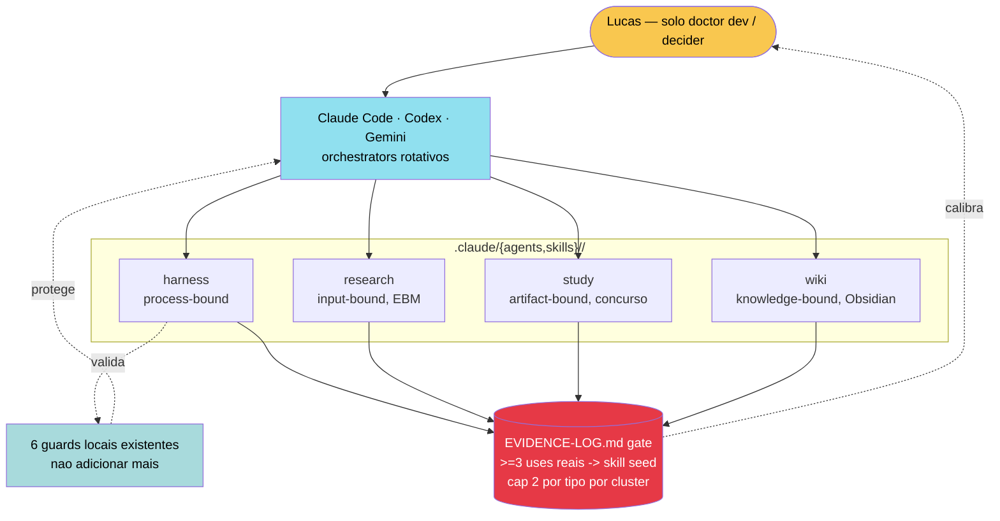

# Cluster Contract — agents/subagents/skills em Prometeus

Data: 2026-04-28
Status: experiment (seed Phase 0; cap e gate vivem; conteudo zero ate evidencia justificar)
Escopo: contrato unico para `.claude/agents/<cluster>/` e `.claude/skills/<cluster>/`. Substitui a regra anterior `KBP-04` "mantem zero".

## Por que existe

Tendencia industria 2026 das 3 plataformas (Claude Code, Codex, Gemini) e separar capacidades em agents/subagents/skills declarativos. Prometeus aceita o padrao, mas com cap baixo + cluster fixo + gate de evidencia para evitar a sprawl observada em `/mnt/c/Dev/Projetos/OLMO` (21 agents, 19 skills, 35 hooks sem gate documentado). OLMO e precedente, nao autoridade — ver `shadow/SOTA-DECISIONS.md > Evidence-first applied to subagent reports (2026-04-28)`.

## Topologia (mermaid)



## Layout em disco

```
.claude/
├── agents/
│   ├── harness/    # cluster: validacao, integrity, boundary
│   ├── research/   # cluster: SOTA gate, EBM, PubMed, Scholar
│   ├── study/      # cluster: trilhas, concurso, anki
│   └── wiki/       # cluster: Obsidian, crossref, graph
├── skills/
│   ├── harness/
│   ├── research/
│   ├── study/
│   └── wiki/
├── hooks/          # gitignored, nao versionado
└── settings.local.json   # gitignored
```

Phase 0 (hoje): pastas vazias com `.gitkeep`. Zero `.md` versionado em `.claude/agents/` ou `.claude/skills/`. Skills/agents entram em rodadas futuras, um por vez, apos gate.

## Regras vivas

- **4 clusters fixos:** `harness`, `research`, `study`, `wiki`. Adicao de novo cluster (5o) exige: trigger registrado em `shadow/SOTA-DECISIONS.md` + retire de cluster orfao por 60d + aprovacao humana explicita por rodada.
- **Cap por cluster por tipo:** **2** itens (agents max 2, skills max 2). Total max teorico = 4 × (2 + 2) = 16. Realista 12m = 4-6 itens.
- **Gate de adicao:**
  - Skill: procedure operacional precisa de `>=3 entries em shadow/EVIDENCE-LOG.md em 30d` para virar skill seed em cluster apropriado.
  - Agent (subagent): so depois de skill `operational` por 30d + trigger novo registrado em `SOTA-DECISIONS.md`.
- **Sem cluster cross:** um item vive em UM cluster. Se o uso for cross-cluster, virar skill em cada cluster (paga o custo de duplicacao deliberadamente).
- **Anti-sprawl:** se cap atingido em cluster, retirar item dormante (>60d sem uso registrado em `EVIDENCE-LOG.md`) ANTES de adicionar novo. Nao expandir cap por reflexo.
- **Lucas decider unico:** nenhum agent/skill executa write externo, push, commit ou cria scaffold sem confirmacao humana por rodada. Boundary `AGENTS.md > Fundamental Boundary` continua valida.

## Frontmatter obrigatorio (skills)

Cada `.claude/skills/<cluster>/<name>/SKILL.md` precisa de:

```yaml
---
name: <curto, verbo-substantivo>
description: <1 frase para matching implicito>
trigger: <quando entra>
non-trigger: <quando nao entra>
source: <caminho do procedure em shadow/>
status: seed | operational | retired
owner: Lucas
cluster: harness | research | study | wiki
---
```

8 campos obrigatorios. `cluster` deve bater com a pasta pai. `status=seed` para promovido recente; `operational` apos 30d sem edit estrutural + uso continuo; `retired` quando dormante >60d. Edits estruturais vao no procedure em `shadow/`; SKILL.md so atualiza quando trigger ou description mudam.

## Frontmatter obrigatorio (agents/subagents)

Cada `.claude/agents/<cluster>/<name>.md` precisa de (alem dos campos Claude Code padroes `name`, `description`, `tools`):

```yaml
---
name: <curto>
description: <quando este subagent entra>
cluster: harness | research | study | wiki
source: <skill operacional de origem ou procedure>
status: seed | operational | retired
owner: Lucas
---
```

Subagent so entra apos pelo menos uma skill `operational` no mesmo cluster ter mostrado que matching/triagem manual cria retrabalho que justifica delegacao automatica.

## Path to principal (criterio de promocao Prometeus -> projeto principal)

Prometeus pode ser promovido a "projeto principal" (sucedendo OLMO) quando, simultaneamente, todos os criterios baixo estiverem `true` por >=30 dias consecutivos. Critérios sao **autossuficientes** — definidos pela barra Prometeus, nao "melhor que OLMO" (que tem barra incerta por ter sido vibe-coded):

1. **Maturidade executavel:** harness `check.sh --strict` + `integrity.sh` + `simulate-ci.sh` passam em CI remoto verde por 30d consecutivos sem skip.
2. **Boundary 100%:** zero write externo registrado em `EVIDENCE-LOG.md` por toda a vida do projeto.
3. **Anti-teatro:** zero check orfao no harness por 30d. Cluster contract com cap respeitado em todas as auditorias.
4. **Evidencia operacional:** >=3 procedures em estado `operational` (cada uma com >=3 entries em `EVIDENCE-LOG.md`).
5. **PHI/seguranca:** detector + checklist + threat-model wired; >=1 catch real registrado.
6. **Reversibilidade:** todo cherrypick documentado em `INCORPORATION-LOG.md` com rollback + criterio negativo testado.
7. **Self-evolution:** >=4 batches em `internal/evolution/backlog.json` no estado `applied` com evidencia de uso real (nao so commit).
8. **Decisao humana reafirmada** em `SOTA-DECISIONS.md` na semana da promocao.

Hoje (2026-04-28): 0/8 criterios atingidos. Estimativa 12-18 meses. Nao acelerar artificialmente. Nenhum criterio e satisfeito por "OLMO esta pior" — Prometeus precisa atingir a barra absoluta.

Quando atingido, abrir `shadow/PROMOTION-PROPOSAL.md` com auditoria interna, migrar trabalho ativo, OLMO vai para `archive/` com freeze de write.

## Humildade simetrica

A mesma doutrina (evidencia-first, cap, cluster, anti-sprawl, gate, evidence-log, sota-decisions) se aplica ao eventual sucessor de Prometeus. `Path to principal` e reversivel: se um futuro projeto exceder Prometeus pelos mesmos criterios absolutos por 30d, Prometeus migra para `archive/` com freeze, sem disputa. A doutrina e o que persiste; o artefato e descartavel.

## Diferenca explicita vs OLMO (descritivo, nao normativo)

| Dimensao | OLMO (vibe-coded) | Prometeus seed | Prometeus mature (12m) |
|---|---|---|---|
| Clusters | 5 (sprawl) | 4 (curados) | 4-5 (so se trigger registrado) |
| Agents | 21 (sem gate claro) | 0 | <=8 (cada um com >=3 evidencias) |
| Skills | 19 (sem gate claro) | 0 | <=8 (cada uma com >=3 evidencias) |
| Hooks | 35 (orquestral) | 6 (guards) | <=8 (cap rigido) |
| Adicao | Implicita / por demanda | Gate >=3 evidencias + SOTA decision | Gate >=3 evidencias + SOTA decision |
| Curadoria | Nao registrada | Explicita | Explicita |
| Anti-sprawl | Ausente | Cap + retire-before-add | Cap + retire-before-add |

## Validacao

`scripts/integrity.sh > check_cluster_contract` (a ser implementado no batch B3) valida:

- toda subdir em `.claude/{agents,skills}/` e um dos 4 clusters fixos;
- cada cluster: `count(agents)<=2`, `count(skills)<=2`;
- cada `SKILL.md` tem 8 frontmatter fields incluindo `cluster` batendo com a pasta;
- total surface (`.claude/agents/` + `.claude/skills/`) <=16.

## Cross-refs

- `shadow/AGENT-USAGE.md > Local skills contract` — detalhes operacionais de SKILL.md e tabela procedure->agente.
- `shadow/KBP.md > KBP-04` — pointer canonical.
- `shadow/SOTA-DECISIONS.md > Cluster architecture seed (2026-04-28)` — decisao registrada.
- `shadow/INCORPORATION-LOG.md` 2026-04-28 — transicao aplicada.
- `AGENTS.md § Layout` + `CLAUDE.md > Things that will bite you #KBP-04` — referencias finas.

Coautoria: Lucas + Claude Opus 4.7 (1M)
